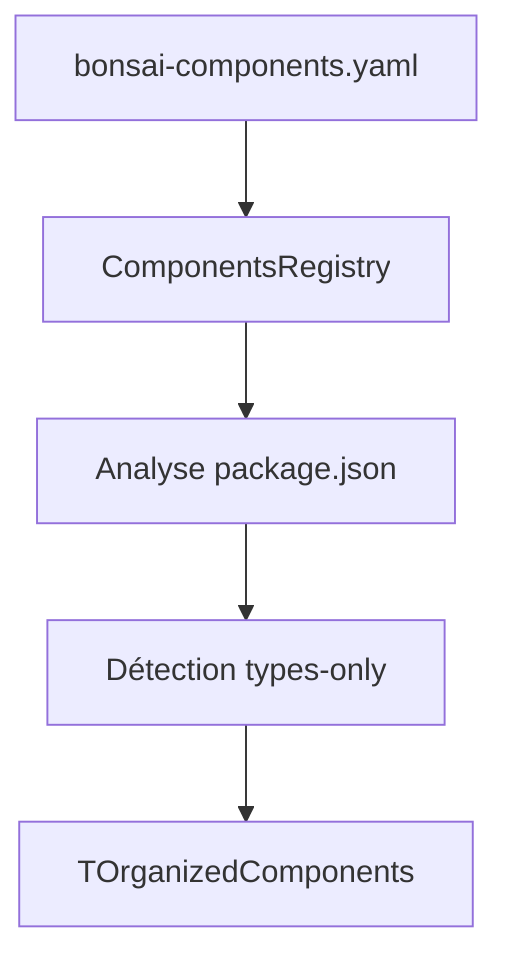
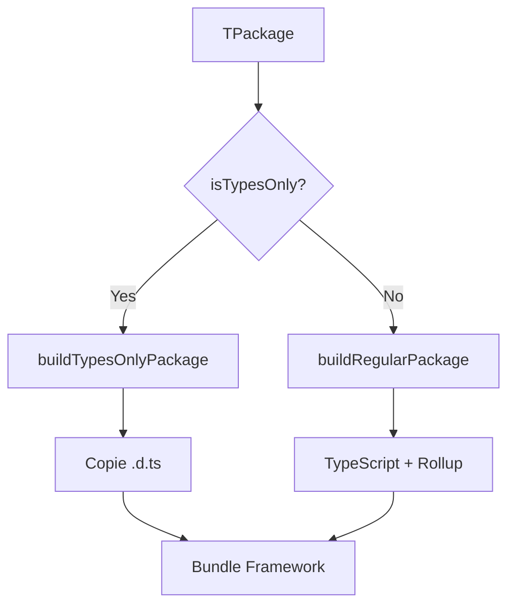
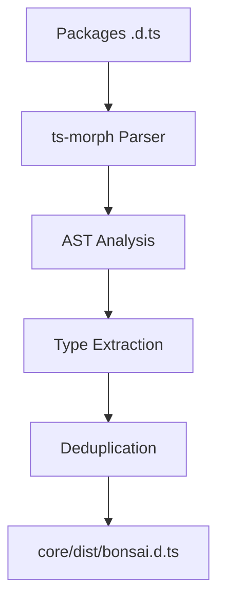

# Architecture Technique du Système de Build

Ce document fournit une analyse technique approfondie de l'architecture du système de build Bonsai.

## Architecture détaillée

### Classes principales

#### 1. ComponentsRegistry

**Responsabilité** : Analyse et classification des packages

```typescript
class ComponentsRegistry {
  // Détection automatique des types de packages
  static async detectTypesOnlyPackage(
    packagePath: string,
    packageJson: IPackageJson
  ): Promise<boolean>;

  // Collection et organisation des composants
  async collect(): Promise<TOrganizedComponents>;

  // Analyse d'un package individuel
  private async collectComponent(
    packageName: string,
    isLibrary: boolean
  ): Promise<TPackage>;
}
```

**Algorithme de détection types-only** :

1. **Analyse exports** : Vérification que seul le champ `"types"` est présent
2. **Analyse main** : Le champ `main` doit être absent ou pointer vers `.d.ts`
3. **Analyse sources** : Examen du contenu des fichiers `.ts` pour détecter du code exécutable
4. **Validation AST** : Utilisation de regex pour identifier les exports de types purs

#### 2. Builder

**Responsabilité** : Orchestration de la compilation

```typescript
class Builder {
  // Point d'entrée principal
  async buildPackage(package: TPackage): Promise<void>;

  // Stratégie pour packages réguliers
  private async buildRegularPackage(package: TPackage): Promise<void>;

  // Stratégie optimisée pour types-only
  private async buildTypesOnlyPackage(package: TPackage): Promise<void>;
}
```

**Logique de décision** :

```typescript
async buildPackage(package: TPackage): Promise<void> {
  if (package.isTypesOnly) {
    // Copie directe des fichiers .d.ts
    await this.buildTypesOnlyPackage(package);
  } else {
    // Pipeline complet : TypeScript → Rollup → Bundle
    await this.buildRegularPackage(package);
  }
}
```

#### 3. Générateur de bundle de types

**Responsabilité** : Création du bundle framework unifié

```typescript
// Utilisation de ts-morph pour l'analyse AST
const project = new Project();
const sourceFile = project.addSourceFileAtPath(filePath);

// Extraction des types
const typeAliases = sourceFile.getTypeAliases();
const interfaces = sourceFile.getInterfaces();
const enums = sourceFile.getEnums();
```

**Système de déduplication** :

```typescript
const definedTypes = new Set<string>();

// Vérification avant ajout
if (!definedTypes.has(typeName)) {
  definedTypes.add(typeName);
  // Ajouter le type au bundle
}
```

## Flux de données

### 1. Initialisation



### 2. Build Pipeline



### 3. Bundling Framework



## Optimisations de performance

### 1. Build incrémental

**Problème** : Éviter de rebuilder les packages non modifiés

**Solution** : Système de cache basé sur les timestamps et checksums

```typescript
// Vérification si le build est nécessaire
const needsBuild = await this.cache.packageNeedsRebuild(package);
if (!needsBuild) {
  this.logger.info(`⚡ Package ${package.name} is up to date`);
  return;
}
```

### 2. Parallélisation

**Problème** : Les bibliothèques externes n'ont pas de dépendances entre elles

**Solution** : Build en parallèle des libraries

```typescript
// Build des libraries en parallèle
await Promise.all(libraries.map((lib) => this.buildPackage(lib)));

// Build séquentiel des packages (dépendances possibles)
for (const pkg of packages) {
  await this.buildPackage(pkg);
}
```

### 3. Types-only optimization

**Problème** : Compilation TypeScript inutile pour des fichiers de définition

**Solution** : Copie directe des fichiers `.d.ts`

```typescript
async buildTypesOnlyPackage(package: TPackage): Promise<void> {
  // Pas de compilation, juste une copie
  await fs.copy(
    path.join(package.srcPath, 'index.d.ts'),
    path.join(package.distPath, 'index.d.ts')
  );
}
```

**Gain de performance** : ~90% plus rapide pour `@bonsai/types`

## Gestion des erreurs

### 1. Validation des packages

```typescript
// Validation structure package.json
if (!packageJson.name) {
  throw new Error(`Package ${packageName} has no name in package.json`);
}

// Validation existence des fichiers source
try {
  await fs.access(srcFile);
} catch {
  throw new Error(`Source file not found: ${srcFile}`);
}
```

### 2. Compilation TypeScript

```typescript
// Capture des erreurs TypeScript
const result = ts.transpileModule(sourceCode, compilerOptions);
if (result.diagnostics?.length) {
  const errors = result.diagnostics.map((d) => d.messageText).join("\n");
  throw new Error(`TypeScript compilation failed:\n${errors}`);
}
```

### 3. Rollback automatique

En cas d'erreur pendant le build :

1. **Nettoyage** : Suppression des fichiers partiellement générés
2. **Logs** : Sauvegarde des erreurs pour diagnostic
3. **État** : Restauration de l'état précédent

## Extensibilité

### Ajouter un nouveau type de package

1. **Étendre les types** :

```typescript
// build.type.ts
export type TPackage = {
  // ...existing properties...
  isMyNewType?: boolean;
};
```

2. **Ajouter la détection** :

```typescript
// components-registry.ts
static async detectMyNewTypePackage(packagePath: string): Promise<boolean> {
  // Logique de détection
}
```

3. **Implémenter la stratégie de build** :

```typescript
// builder.class.ts
private async buildMyNewTypePackage(package: TPackage): Promise<void> {
  // Logique de build spécifique
}
```

4. **Mettre à jour le dispatcher** :

```typescript
async buildPackage(package: TPackage): Promise<void> {
  if (package.isMyNewType) {
    await this.buildMyNewTypePackage(package);
  } else if (package.isTypesOnly) {
    await this.buildTypesOnlyPackage(package);
  } else {
    await this.buildRegularPackage(package);
  }
}
```

## Métriques et monitoring

### Logs structurés

```typescript
// Logs avec émojis pour la lisibilité
this.logger.info("🔍 Analyzing packages...");
this.logger.info("📝 Package detected as types-only");
this.logger.info("🔨 Building package...");
this.logger.info("✅ Build completed successfully");
```

### Temps de build

```typescript
const startTime = Date.now();
await this.buildPackage(package);
const duration = Date.now() - startTime;
this.logger.info(`⏱️  Built in ${duration}ms`);
```

### Statistiques

- Nombre de packages buildés
- Temps total de build
- Packages skippés (cache hit)
- Erreurs rencontrées

## Tests et validation

### Tests unitaires

```typescript
describe("ComponentsRegistry", () => {
  test("should detect types-only package", async () => {
    const isTypesOnly = await ComponentsRegistry.detectTypesOnlyPackage(
      "/path/to/types-package",
      mockPackageJson
    );
    expect(isTypesOnly).toBe(true);
  });
});
```

### Tests d'intégration

```typescript
describe("Build Pipeline", () => {
  test("should build complete framework", async () => {
    await buildOrchestrator.buildFramework();

    // Vérifier que les fichiers sont générés
    expect(fs.existsSync("core/dist/bonsai.d.ts")).toBe(true);
    expect(fs.existsSync("core/dist/bonsai.js")).toBe(true);
  });
});
```

## Maintenance et debugging

### Logs de debug

Activer les logs détaillés :

```bash
DEBUG=bonsai:build pnpm run build
```

### Nettoyage du cache

```bash
# Nettoyer le cache de build
pnpm run build:clean

# Rebuilder complètement
pnpm run build:clean && pnpm run build
```

### Diagnostic des erreurs

1. **Vérifier la configuration** : `bonsai-components.yaml`
2. **Examiner les logs** : Rechercher les émojis d'erreur ❌
3. **Valider les package.json** : Structure et champs requis
4. **Tester individuellement** : Builder un package spécifique

---

> 🔧 **Note technique** : Cette architecture privilégie la performance et la maintenabilité. Chaque composant a une responsabilité claire et l'ensemble est facilement extensible.
